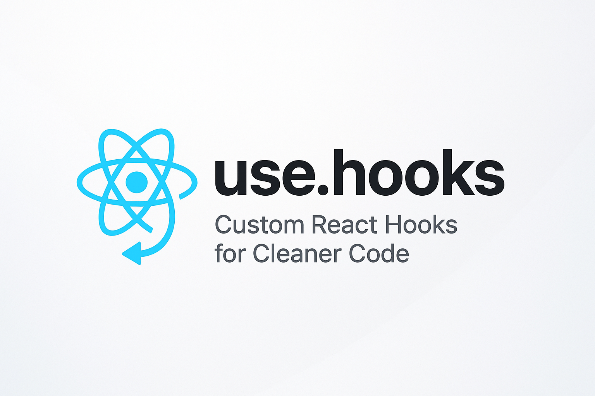

# use.hooks



A collection of **custom React hooks** to simplify state management, side effects, and common patterns in React projects.

This repository provides a set of reusable hooks designed to make React development faster, cleaner, and more intuitive.

---

## Installation

```bash
npm install use.hooks
# or
yarn add use.hooks
```

---

## Available Hooks

### `useDocumentTitle`

Easily set and update the document title.

```ts
useDocumentTitle("My Page Title");
```

---

### `useDefault`

Initialize state with a default value if the initial value is `null` or `undefined`.

```ts
const { state, setState } = useDefault(initialValue, defaultValue);
```

---

### `useToggle`

Manage boolean state with an optional override.

```ts
const { toggle, handleToggle } = useToggle(true);

// Toggle value
handleToggle();

// Set value explicitly
handleToggle(false);
```

---

### `usePrevious`

Track the previous value of a state or prop.

```ts
const previousValue = usePrevious(currentValue);
```

---

### `usePreferredLanguage`

Track the user's preferred browser language and automatically update on changes.

```ts
const language = usePreferredLanguage();
```

---

## Contributing

Contributions are welcome! Feel free to submit issues or pull requests with new hooks or improvements.
